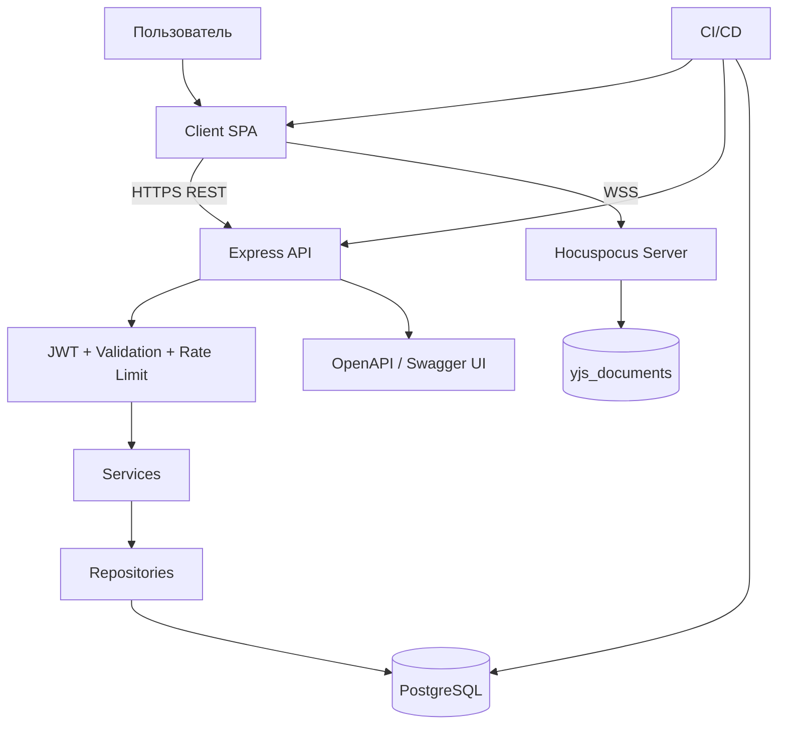
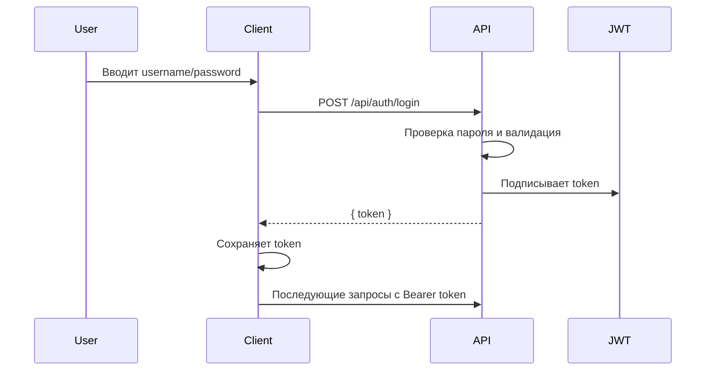
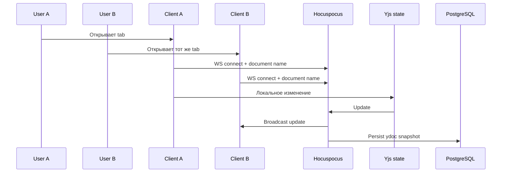

**Общая документация проекта `[PROJECT_NAME]`.**  
Рабочее название по текущему репозиторию — **Collab App**, но этот документ специально написан так, чтобы его можно было быстро адаптировать и под другое имя продукта. С точки зрения бизнеса проект — это совместное рабочее пространство, где пользователи создают проекты, приглашают участников и работают над несколькими типами вкладок. С технической точки зрения это full-stack web system с чётким разделением на SPA-клиент, REST API, real-time collaboration layer, PostgreSQL-хранилище и минимальный DevOps-контур. fileciteturn0file0

**Цели проекта.**  
Главные цели системы: дать нескольким пользователям единое пространство для совместной работы; разграничить права доступа к проектам; обеспечить real-time синхронизацию без ручных merge-конфликтов; позволить расширять типы вкладок без полной перестройки ядра; и иметь прозрачный API-контракт, понятный как frontend/backend-команде, так и внешним интеграторам. Эти цели хорошо согласуются и с текущей структурой репозитория, и с тем, как официальные docs Yjs/Hocuspocus/OpenAPI описывают свои роли в архитектуре. fileciteturn0file0 citeturn5view8turn5view7turn13view0

**Канонический словарь терминов.**

| Термин | Значение в проекте |
|---|---|
| Проект | рабочее пространство, принадлежащее owner и доступное invited users |
| Вкладка | единица совместной работы внутри проекта |
| Текстовая вкладка | Tiptap/Yjs-документ |
| Графическая вкладка | Excalidraw/Yjs-сцена |
| Роль | `owner`, `editor`, `viewer` |
| Yjs-документ | CRDT-состояние для совместного редактирования |
| Hocuspocus | WebSocket collaboration server для Yjs |
| OpenAPI | контракт API, из которого строятся docs и тестовые сценарии |

Терминология выше выведена из реальной модели сущностей в коде и БД. fileciteturn0file0

**Полная архитектура системы.**  
Эта диаграмма отражает рекомендуемое каноническое видение системы, которое стоит использовать и в README, и в архитектурных ревью. Она опирается на фактический код репозитория и на официальные docs React/Vite/Express/Hocuspocus/Yjs/PostgreSQL/OpenAPI. fileciteturn0file0 citeturn2view0turn2view1turn6view3turn5view7turn5view8turn13view0turn15view0



**Sequence flow: вход пользователя.**  
Этот сценарий полностью соответствует текущей связке `login -> JWT -> localStorage -> axios interceptor`. JWT по RFC — компактный URL-safe контейнер claims, а клиент действительно декодирует его срок жизни локально до инициализации сессии. fileciteturn0file0 citeturn7view3



**Sequence flow: совместное редактирование.**  
Yjs официально описывает себя как CRDT-слой, который синхронизирует изменения и автоматически мержит конкурентные апдейты, а Hocuspocus — как WebSocket backend для Yjs. Это и есть ключевой технологический смысл текущего продукта. citeturn5view8turn5view7turn10view3



**Сравнение common options и рекомендуемые дефолты.**  
Ниже — тот самый template-компонент документации, который полезен для stakeholder discussion: тут перечислены распространённые опции по слоям и сразу указан рекомендуемый дефолт для этого репозитория. Основание для сравнения — официальные docs React/Vue/Angular, Express/Flask/Gin, PostgreSQL/MySQL/MongoDB и спецификации JWT/OAuth 2.0; итоговая рекомендация — инженерный вывод из текущей кодовой базы. citeturn2view0turn7view0turn7view1turn6view3turn4view0turn7view5turn15view0turn7view6turn7view2turn7view3turn7view4

| Слой | Варианты | Что выбрать по умолчанию | Почему |
|---|---|---|---|
| Frontend | React / Vue / Angular | **React + Vite** | текущий код уже на React, редакторы и роутинг встроены |
| Backend | Express / Flask / Gin | **Node.js + Express** | код, тесты и DevOps уже завязаны на Node |
| DB | PostgreSQL / MySQL / MongoDB | **PostgreSQL** | текущая схема реляционная, с FK, каскадами и Yjs persistence |
| Auth | JWT / OAuth2 | **JWT** | достаточно для first-party SPA/API; OAuth2 нужен, если появится SSO/delegation |
| Realtime | Hocuspocus + Yjs / другой WS слой | **Hocuspocus + Yjs** | уже реализован и хорошо совпадает с collaborative domain |
| API contract | ad-hoc docs / OpenAPI | **OpenAPI** | уже присутствует swagger-контур и это лучший единый источник правды |

**Единый quick start для разработчика.**  
В документации на верхнем уровне стоит зафиксировать самый короткий жизнеспособный сценарий поднятия системы: отдельно backend, отдельно frontend, а затем ручная проверка `/api-docs`, логина и открытия одной текстовой вкладки. Это сильно сокращает time-to-first-success для нового разработчика. fileciteturn0file0

```bash
# 1. Server
cd server
cp .env.example .env
npm install
npm run db:init
npm run dev

# 2. Client
cd ../client
cp .env.example .env
npm install
npm run dev

# 3. Verify
# - открыть http://localhost:5173
# - открыть http://localhost:5000/api-docs
# - зарегистрироваться, создать проект, открыть текстовую вкладку
```

**Единая матрица env-переменных.**  
Vite-переменные доступны клиенту только с префиксом `VITE_`; серверные секреты должны жить отдельно. Это правило нужно повторить в `common.md`, потому что именно здесь продуктовая и техническая документация сходятся. citeturn8view0turn9view10

| Переменная | Где используется | Пример | Комментарий |
|---|---|---|---|
| `VITE_BACKEND_URL` | client | `http://localhost:5000` | публичный адрес REST API |
| `VITE_WS_URL` | client | `ws://localhost:1234` | публичный адрес collaboration server |
| `PORT` | server | `5000` | REST API port |
| `HOCO_PORT` | server | `1234` | Hocuspocus port |
| `CLIENT_URL` | server | `http://localhost:5173` | CORS allowlist origin |
| `JWT_SECRET` | server | `change-me` | секрет подписи JWT |
| `DATABASE_URL` | server | `postgresql://...` | приоритетный вариант подключения |
| `DB_HOST`/`DB_PORT`/... | server | `localhost` / `5432` | fallback-конфигурация |
| `DB_DATABASE` | server | `collab_app` | каноническое имя БД |
| `DB_TEST_DATABASE` | server | `collab_app_test` | каноническое имя тестовой БД |

**CI/CD outline.**  
GitHub Actions официально рекомендует `setup-node` для фиксирования версии Node.js, а Vite docs показывают типовой pipeline build → upload `dist` → deploy на статический хост. Для этого проекта логично разделить pipeline на два независимых job-класса: `client-ci` и `server-ci`, плюс отдельные deploy stages. citeturn6view8turn9view5turn14view1

```yaml
name: CI

on:
  push:
    branches: [main, develop]
  pull_request:

jobs:
  client-ci:
    runs-on: ubuntu-latest
    defaults:
      run:
        working-directory: client
    steps:
      - uses: actions/checkout@v6
      - uses: actions/setup-node@v4
        with:
          node-version: 20.x
      - run: npm install
      - run: npm run lint
      - run: npm run build

  server-ci:
    runs-on: ubuntu-latest
    defaults:
      run:
        working-directory: server
    services:
      postgres:
        image: postgres:16
        env:
          POSTGRES_USER: postgres
          POSTGRES_PASSWORD: postgres
          POSTGRES_DB: collab_app_test
        ports:
          - 5432:5432
    env:
      NODE_ENV: test
      JWT_SECRET: test-secret
      DB_HOST: localhost
      DB_PORT: 5432
      DB_USER: postgres
      DB_PASSWORD: postgres
      DB_TEST_DATABASE: collab_app_test
    steps:
      - uses: actions/checkout@v6
      - uses: actions/setup-node@v4
        with:
          node-version: 20.x
      - run: npm install
      - run: npm run test
```

**Схема деплоя.**  
Клиентская часть после `vite build` превращается в статический `dist`, который можно размещать на GitHub Pages, Netlify, Render Static Site, Cloudflare Pages или другом static host. Серверная часть — обычный Node process за reverse proxy, рядом с PostgreSQL и открытым WSS для Hocuspocus. В production-документации важно отдельно описать split между `REST base URL` и `WS URL`, иначе проблемы конфигурации будут выглядеть как «сломанный редактор», хотя на деле это просто неверная сборка env. citeturn14view1turn9view5

**Security baseline, который должен быть закреплён командно.**  
Минимальный production baseline выглядит так: TLS на всём трафике, Helmet, строгая allowlist-валидация входа, rate limit на чувствительных маршрутах, секреты не хранятся в `VITE_*`, логи безопасности отделены от бизнес-логов, а JWT-секреты меняются централизованно через секрет-хранилище CI/CD. Express docs и OWASP прямо поддерживают этот набор практик. citeturn9view0turn9view1turn9view2turn9view3turn9view4turn8view0

**Логирование и мониторинг.**  
Для документации стоит закрепить две линии наблюдаемости: application logs и health/performance metrics. Application logs уже логично строить на Pino; для мониторинга надо добавить как минимум health endpoint, latency/error rate по API, количество активных WS connections, размер Yjs-документов и состояние PostgreSQL connection pool. Это особенно важно, потому что collaborative editor нагружает систему не только HTTP-трафиком, но и длительными WebSocket-сессиями. fileciteturn0file0 citeturn12view2turn6view4turn10view2

**Backup, restore и миграции.**  
До появления formal migration tool официальный процесс должен быть таким: `db.sql` хранится под ревью, изменения схемы идут через PR, prod backups выполняются через `pg_dump`, восстановление — через `pg_restore`, а после каждого schema change пересобирается и test bootstrap. Это не идеальная зрелость, но это честный и управляемый процесс для нынешнего состояния проекта. fileciteturn0file0 citeturn15view2turn15view3

**Имплементационные риски и FAQ.**  
Если регистрация падает после свежего `db:init`, первым делом проверить конфликт `hashedPassword` vs `password`; если тесты проходят, а приложение падает, проверить, не живут ли тесты на старой схеме `documents`; если клиент не удаляет вкладку, сравнить `/api/tabs/:tabId` и текущий mount-path роутера; если вкладка типа `mindmap` создаётся на клиенте, но падает при insert, проблема почти наверняка в DB-check constraint; если запросы к серверу из браузера блокируются, проверить `CLIENT_URL`; если rich-text toolbar показывает кнопки, которые «ничего не делают», проверить фактический список Tiptap extensions в `TextEditor.jsx`; если real-time не стартует, проверить единый источник истины для `VITE_WS_URL` вместо смеси env и hardcoded `127.0.0.1:1234`. fileciteturn0file0

**Contribution guide.**  
Рекомендуемый командный процесс для этого репозитория: любая новая feature идёт отдельной веткой; все PR обязаны обновлять документацию, если меняют маршруты, env-переменные, схему БД или UI-flows; изменения API сопровождаются обновлением Swagger-комментариев; изменения схемы БД сопровождаются обновлением `db.sql`, тестового bootstrap и backup/restore notes; PR не считается готовым, пока frontend проходит build/lint, а backend — tests. Это не «факт текущего репозитория», а рекомендуемый регламент, который лучше всего соответствует уже существующему устройству проекта. fileciteturn0file0

**Лицензия.**  
Во входной выгрузке серверный `package.json` содержит поле лицензии `ISC`, но на уровне корня репозитория явный `LICENSE`-файл в дереве не показан. Поэтому для публичной поставки или внутреннего enterprise-использования правильнее считать лицензионный статус **не завершённо оформленным**: выбрать единую repository-wide лицензию, положить `LICENSE` в корень и синхронизировать package metadata между client и server. fileciteturn0file0

**Открытые вопросы и ограничения.**  
В предоставленной выгрузке некоторые файлы были скрыты как binary placeholder, включая `server/realtime/hocuspocus_server.js`, часть routing/CSS и отдельные тесты. Поэтому детали hooks аутентификации на WebSocket-уровне, финального route map клиента и полного тестового покрытия задокументированы здесь по максимально надёжным косвенным признакам — импортам, mount-path, package dependencies и местам вызова, — но не как полностью подтверждённая строка-в-строку реализация. Это ограничение важно сохранить в `common.md`, чтобы у команды не возникло ложного чувства «всё уже проверено до байта». fileciteturn0file0