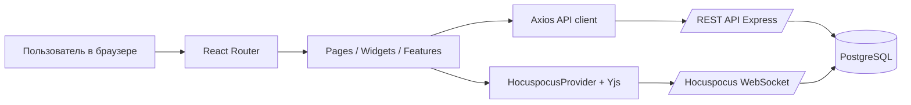

## client.md

**Клиентская документация проекта `[PROJECT_NAME]`**  
Рабочее имя по текущему клиентскому коду — **Collab App**. Клиентская часть — это SPA, которая отвечает за аутентификацию пользователя, навигацию по проектам, отображение вкладок, запуск совместного текстового редактора и совместной whiteboard-сцены. По структуре каталогов и зависимостям видно, что здесь используется компонентная модель React, dev/build пайплайн Vite, собственный `axios`-клиент с Bearer-токеном, а также real-time слой на `@hocuspocus/provider` и `yjs`. fileciteturn0file0 citeturn2view0turn2view1turn10view1turn5view8turn12view5

**Назначение клиента.**  
Клиент предназначен для трёх основных пользовательских сценариев: вход и управление аккаунтом, работа с проектами и участниками, а также совместное редактирование содержимого вкладок в реальном времени. В явном виде это подтверждают страницы `LoginPage`, `RegisterPage`, `ProjectsDashboardPage`, `ProjectDetailPage`, `SettingsPage`, компоненты `TextEditor`, `BoardEditor`, форма создания вкладки, провайдер аутентификации и API-слой `shared/api/axios.js`. fileciteturn0file0

**Наблюдаемые пользовательские возможности.**  
Уже реализованы: регистрация, логин, хранение JWT на клиенте, автодозагрузка текущего пользователя, список проектов, открытие конкретного проекта, получение и создание вкладок, совместная текстовая вкладка на Tiptap/Yjs/Hocuspocus и совместная графическая вкладка на Excalidraw/Yjs/Hocuspocus. При этом `CodeEditor.jsx` пустой, а в кодовой базе ещё остались legacy-следы старой сущности `documents`, так что документация должна трактовать кодовую вкладку как запланированную, а не завершённую функциональность. fileciteturn0file0

**Архитектура клиента.**  
Диаграмма ниже описывает фактическую клиентскую модель: React-компоненты через `react-router-dom` управляют навигацией, HTTP-вызовы идут через `axios`, а совместное редактирование выходит в Hocuspocus WebSocket и синхронизируется CRDT-моделью Yjs. React позиционирует приложение как композицию компонентов, Vite — как быстрый dev/build-контур, Hocuspocus — как WebSocket-backend для Yjs, а Yjs — как CRDT-набор строительных блоков для коллаборативных приложений. fileciteturn0file0 citeturn2view0turn2view1turn5view7turn5view8



**Подтверждённый стек клиента и его роль.**  
Версии ниже взяты из `client/package.json`, а роль ключевых библиотек — из их официальной документации. Отдельно важно, что Radix здесь хорошо подходит для кастомного интерфейса редактора, потому что библиотека делает акцент на accessibility, кастомизации и low-level primitives без навязанных стилей. fileciteturn0file0 citeturn9view9turn9view8turn12view6turn10view1turn5view9turn12view1

| Зона | Библиотека | Версия в репозитории | Зачем используется |
|---|---|---:|---|
| UI core | `react` | `^18.2.0` | компонентная модель интерфейса |
| DOM rendering | `react-dom` | `^18.3.1` | рендеринг SPA в браузере |
| Routing | `react-router-dom` | `^7.6.2` | маршрутизация и приватные маршруты |
| Build/dev | `vite` | `^7.3.3` | быстрый dev server и production build |
| HTTP | `axios` | `^1.9.0` | REST-вызовы и interceptor для токена |
| Auth helper | `jwt-decode` | `^4.0.0` | локальная проверка срока жизни JWT |
| Real-time | `@hocuspocus/provider` | `^3.4.3` | подключение к WebSocket collaboration layer |
| CRDT | `yjs` | `^13.6.29` | синхронизация данных без merge-конфликтов |
| Rich text | `@tiptap/react` | `^3.15.3` | редактор текста |
| Rich text extensions | `@tiptap/starter-kit`, `@tiptap/extension-collaboration` | `^3.15.x` | форматирование и коллаборация |
| Whiteboard | `@excalidraw/excalidraw` | `^0.18.1` | совместное рисование |
| UI primitives | `@radix-ui/react-toolbar`, `tooltip`, `dropdown-menu` | `^1.x / ^2.x` | панель инструментов и доступные popups |
| UX | `react-hot-toast` | `^2.5.2` | уведомления |
| Дополнительно | `tldraw`, `@tldraw/sync` | `^4.2.3` | задел под альтернативную whiteboard/синхронизацию |

Подтверждённые версии — из репозитория, а назначение библиотек — из официальных источников. fileciteturn0file0 citeturn2view0turn2view1turn10view1turn5view9turn9view9turn12view1turn12view6

**Шаблон выбора фронтенд-стека, если проект будет переиспользован как template.**  
Сводка ниже основана на том, как официальные docs описывают React, Vue и Angular; рекомендация сформулирована как инженерный вывод из текущего кода и команды, которая уже живёт в React-экосистеме. citeturn2view0turn7view0turn7view1

| Вариант | Что это по официальным docs | Когда разумно выбирать | Рекомендация для этого репозитория |
|---|---|---|---|
| React + Vite | компонентный UI + быстрый dev/build pipeline | когда нужен гибкий SPA-клиент и богатая экосистема редакторов | **Основной рекомендуемый вариант** |
| Vue + Vite | прогрессивный UI framework с компонентной моделью | когда команда предпочитает более «плавный» DX и шаблонность | хороший альтернативный template |
| Angular | framework с широкой встроенной toolchain | когда нужен enterprise-стандарт и жёсткая архитектурная дисциплина | избыточен для текущего репозитория |

**Структура каталогов клиента.**  
Ниже — сокращённое дерево, отражающее реально наблюдаемый client-side ландшафт. Этот разрез особенно полезен для onboarding: он показывает, что автор проекта уже мыслит слоями `app / entities / features / pages / shared / widgets`. fileciteturn0file0

```text
client/
  package.json
  vite.config.js
  src/
    index.jsx
    app/
      App.jsx
      providers/AuthProvider.jsx
      routes/
    entities/
      project/
      tab/
      user/
    features/
      auth/
      projects/
      tabs/
        board/
        code/
        create_tab/
        text/
      user/settings/
    pages/
      LandingPage.jsx
      LoginPage.jsx
      RegisterPage.jsx
      ProjectsDashboardPage.jsx
      ProjectDetailPage.jsx
      DocumentEditorPage.jsx
      SettingsPage.jsx
    shared/
      api/axios.js
      realtime/hocusSocket.js
      ui/
    widgets/
      Header/
      ProjectGrid/
      TabGrid/
```

**Предварительные требования.**  
Репозиторий не фиксирует `engines`, поэтому в документе стоит прямо написать, что версия Node.js должна быть стандартизована отдельно через `.nvmrc`, Volta или CI matrix. С практической точки зрения клиент требует Node.js, npm и доступный backend URL, а Vite ожидает env-переменные через `import.meta.env`; только переменные с префиксом `VITE_` будут доступны в браузерном коде, и в них нельзя хранить секреты. fileciteturn0file0 citeturn8view0turn9view10turn9view11

**Рекомендуемый `client/.env.example`.**  
Текущий код клиента читает минимум две переменные: `VITE_BACKEND_URL` и `VITE_WS_URL`. Для production лучше хранить только публичные URL, а все секреты держать на сервере, потому что `VITE_*` попадают в клиентский bundle. fileciteturn0file0 citeturn8view0turn9view10

```dotenv
VITE_BACKEND_URL=http://localhost:5000
VITE_WS_URL=ws://localhost:1234
```

**Установка и запуск клиента.**  
Vite использует стандартные npm-скрипты `dev`, `build`, `preview`, а текущий `package.json` клиента подтверждает именно такой набор. Поэтому для onboarding лучше фиксировать простой линейный сценарий установки без лишней магии. fileciteturn0file0 citeturn6view1turn14view1

```bash
cd client
cp .env.example .env
npm install
npm run dev
```

**Сборка и локальная проверка production-билда.**  
По официальной документации Vite production-сборка создаётся через `npm run build`, результат попадает в `dist`, а локально его удобно проверить через `npm run preview`. Это нужно явно прописать в `client.md`, потому что именно так проект будут валидировать QA и DevOps перед выкладкой. citeturn14view1turn14view2

```bash
cd client
npm run build
npm run preview
```

**Линтинг и тесты.**  
В клиентском `package.json` есть `lint`, но нет `test`; при этом зависимости включают Testing Library. То есть в текущем состоянии клиентская документация должна честно указать: фронтенд-пайплайн поддерживает запуск и линтинг, но полноценный unit/integration test contour в репозитории пока не доведён до завершённого вида. Рекомендуемый минимум — добавить `npm test`, smoke-тесты маршрутов и редакторов, а также CI-проверку на build + lint + tests. fileciteturn0file0

```bash
cd client
npm run lint
# TODO: после добавления test-скрипта
# npm test
```

**Рекомендуемая клиентская прослойка API.**  
Текущий код уже создаёт `axios` instance, назначает `baseURL` и подставляет Bearer-токен через request interceptor. Ниже — production-hardening вариант того же паттерна с таймаутом, потому что официальная документация Axios отдельно рекомендует задавать timeout, чтобы подвисший запрос не висел бесконечно. fileciteturn0file0 citeturn12view6turn12view5

```js
import axios from "axios";

export const api = axios.create({
  baseURL: `${import.meta.env.VITE_BACKEND_URL}/api`,
  timeout: 10000,
});

api.interceptors.request.use((config) => {
  const token = localStorage.getItem("token");
  if (token) config.headers.Authorization = `Bearer ${token}`;
  return config;
});

export default api;
```

**Особенности real-time режима.**  
Текстовый редактор создаёт `HocuspocusProvider` с `url` и `name`, затем передаёт `provider.document` в Tiptap Collaboration extension. Whiteboard-компонент использует похожий подход, но синхронизирует сцену Excalidraw через Yjs map. Официальные docs Hocuspocus подтверждают, что provider принимает как минимум `url`, `name`, `document` и `token`, а docs Tiptap подтверждают, что Collaboration extension работает поверх `Y.Doc`. Это значит, что следующая очевидная доработка — добавить передачу auth-токена и единый shared websocket provider, чтобы не плодить лишние соединения. fileciteturn0file0 citeturn10view1turn5view9turn5view7

```js
const provider = new HocuspocusProvider({
  url: import.meta.env.VITE_WS_URL,
  name: tab.ydoc_document_name,
  token: localStorage.getItem("token"),
});
```

**Что важно для UX и accessibility.**  
Панель инструментов текстового редактора построена на Radix Toolbar, Tooltip и DropdownMenu, а официальные docs Radix прямо делают акцент на accessibility, keyboard navigation и отсутствии жёстких стилей. Это сильное архитектурное решение для кастомного редактора: визуальный стиль остаётся полностью у проекта, а базовая интерактивная доступность не собирается вручную. fileciteturn0file0 citeturn9view9turn9view8turn6view5

**Текущие клиентские проблемы, которые обязательно надо зафиксировать в документации.**  
Первое: `AuthProvider` содержит отладочную строку `console.log("LOGIN RESPONSE:", response.data)` внутри чтения токена из `localStorage`, где `response` не определён. Второе: `CodeEditor.jsx` пустой, поэтому кодовая вкладка не является поставленной feature. Третье: `CreateDocumentForm` всё ещё работает с legacy-маршрутом `/documents/project/...`, хотя остальная система уже переехала на `tabs`. Четвёртое: отдельный `shared/realtime/hocusSocket.js` жёстко зашит на `ws://127.0.0.1:1234`, а реальный код редакторов использует `VITE_WS_URL`; это надо унифицировать. Наконец, toolbar rich-text редактора выглядит богаче, чем реальный список Tiptap-extensions в `TextEditor`, поэтому часть кнопок сейчас, вероятно, концептуально опережает фактическую конфигурацию редактора. fileciteturn0file0

**Клиентская безопасность и эксплуатационные правила.**  
В документации стоит прямо зафиксировать четыре правила: не хранить секреты в `VITE_*`, всегда использовать HTTPS/WSS на production, проверять срок жизни JWT перед инициализацией сессии и не считать клиентскую валидацию достаточной сама по себе. Vite предупреждает, что `VITE_*` попадает в клиентский код; Express и OWASP рекомендуют TLS, корректную обработку пользовательского ввода и стандартные защитные middleware. citeturn8view0turn9view10turn9view0turn9view1turn9view3

**Краткий FAQ для клиента.**  
Если frontend стартует, но API отвечает `401`, сначала проверить наличие токена и актуальность `JWT_SECRET` на сервере; если не открывается real-time редактор, сравнить `VITE_WS_URL`, `HOCO_PORT` и реальный route/path Hocuspocus; если вкладка удаляется с ошибкой `404`, проверить серверный mount-path для tabs router; если падает форма старого редактора, убедиться, что код больше не ходит в legacy `/documents`; если production-сборка работает локально, но ломается после выкладки, проверить, что `VITE_BACKEND_URL`/`VITE_WS_URL` указывают на публичные адреса, а не на `localhost`. fileciteturn0file0
