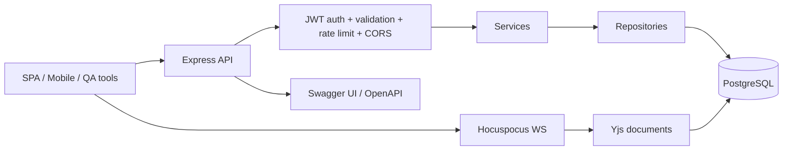

## server.md

**Серверная документация проекта `[PROJECT_NAME]`.**  
Серверная часть — это Node.js-приложение на Express, которое реализует REST API для auth/projects/permissions/tabs, подключается к PostgreSQL через `pg`, публикует OpenAPI/Swagger-документацию, ограничивает попытки логина через `express-rate-limit`, логирует через Pino и поднимает Hocuspocus/Yjs-слой для коллаборативного редактирования. Express официально описывает routing как способ определить, как endpoints реагируют на client requests, а OpenAPI — как переносимый спецификационный слой для всего жизненного цикла API. fileciteturn0file0 citeturn6view3turn13view0

**Назначение сервера.**  
Сервер обеспечивает проверку учётных данных, выпуск JWT, возврат информации о пользователе, смену пароля, удаление аккаунта, CRUD по проектам, список и создание вкладок, управление участниками проекта и хранение Yjs-состояния. В коде это разбито на маршруты `auth`, `projects`, `permissions`, `tabs`, сервисы, репозитории, `db.sql`, `initDb` и отдельный real-time модуль Hocuspocus. fileciteturn0file0

**Архитектура сервера.**  
Это layered backend: входящий HTTP-трафик идёт в Express, проходит через CORS, JSON body parsing, rate-limit и auth middleware, затем спускается на services/repositories и PostgreSQL. Реальное совместное редактирование идёт поверх Hocuspocus как WebSocket-backend, а Yjs хранится в таблице `yjs_documents`. Node-postgres рекомендует pool для веб-приложений с частыми запросами, а docs Hocuspocus прямо позиционируют сервер как масштабируемый WebSocket-backend для Yjs. fileciteturn0file0 citeturn6view4turn5view7turn10view3



**Подтверждённый стек сервера и его роль.**  
Версии взяты из `server/package.json`, а назначение и best practices — из официальных docs Express, PostgreSQL, OpenAPI, Jest, GitHub Actions, Pino и Hocuspocus. fileciteturn0file0 citeturn6view3turn15view2turn15view3turn13view0turn9view6turn12view2turn10view2turn10view3

| Зона | Библиотека | Версия в репозитории | Зачем используется |
|---|---|---:|---|
| HTTP server | `express` | `^5.1.0` | REST API и middleware chain |
| DB driver | `pg` | `^8.16.1` | работа с PostgreSQL |
| Auth tokens | `jsonwebtoken` | `^9.0.2` | выпуск и проверка JWT |
| Password hashing | `bcrypt` | `^6.0.0` | хеширование паролей |
| Validation | `express-validator` | `^7.2.1` | валидация входных payload |
| Rate limiting | `express-rate-limit` | `^8.0.1` | защита логина от brute-force |
| Realtime WS | `@hocuspocus/server` | `^3.4.3` | WebSocket collaboration server |
| Realtime persistence | `@hocuspocus/extension-database` | `^3.4.3` | хранение Yjs-данных |
| API docs | `swagger-jsdoc`, `swagger-ui-express` | `^6.2.8`, `^5.0.1` | генерация и показ API docs |
| Logging | `pino` | `^9.7.0` | низконакладное JSON-логирование |
| Tests | `jest`, `supertest` | `^29.7.0`, `^6.3.4` | unit/integration testing |

**Шаблон выбора backend-стека, если сервер будет переиспользован как template.**  
Официальные docs описывают Express как middleware/routing-ориентированный HTTP framework, Flask — как минимальное WSGI-приложение, а Gin — как high-performance Go web framework. Для этого конкретного репозитория смена стека не имеет смысла, потому что весь код уже реализован в Node/Express и интегрирован с JS frontend tooling. citeturn6view3turn4view0turn7view5

| Вариант | Официальное позиционирование | Когда выбирать | Рекомендация для этого проекта |
|---|---|---|---|
| Node.js + Express | routing + middleware для HTTP API | когда frontend и backend живут в одном JS/TS-контуре | **Основной рекомендуемый вариант** |
| Python + Flask | минимальный app-first web framework | когда нужна очень лёгкая серверная прослойка | запасной template |
| Go + Gin | высокопроизводительный HTTP framework | когда критичны latency и простая статическая компоновка | возможный long-term вариант, но не для текущей кодовой базы |

**Структура каталогов сервера.**  
Ниже — рекомендуемое сокращённое дерево для `server.md`. Оно соответствует фактической структуре выгрузки и хорошо объясняет идею слоёв. fileciteturn0file0

```text
server/
  app.js
  server.js
  package.json
  db.js
  db.sql
  config/
    database.js
    testDb.js
  middleware/
    authMiddleware.js
    checkProjectAccess.js
    checkRole.js
    rateLimiter.js
  repositories/
    userRepository.js
    projectRepository.js
    tabRepository.js
    permissionRepository.js
  routes/
    auth.js
    projects.js
    permissions.js
    tabs.js
  services/
    authService.js
    projectService.js
    tabService.js
    permissionService.js
  realtime/
    hocuspocus_server.js
  scripts/
    initDb.js
  utils/
    logger.js
```

**База данных и модель хранения.**  
Текущая `db.sql` создаёт таблицы `users`, `projects`, `tabs`, `yjs_documents`, `project_permissions` и набор индексов. PostgreSQL официально описывает foreign keys как средство поддержания referential integrity между связанными таблицами, а `ON DELETE CASCADE` — как механизм автоматического каскадного удаления зависимых строк, когда дочерняя сущность является частью родительской. Именно это хорошо соответствует структуре `projects -> tabs -> yjs_documents` и `projects -> project_permissions`. fileciteturn0file0 citeturn15view0turn15view1

**Ключевые сущности сервера.**

| Сущность | Назначение | Ключевые поля |
|---|---|---|
| `users` | учетные записи | `id`, `username`, `email`, `hashedPassword` |
| `projects` | рабочие пространства | `id`, `name`, `description`, `owner_id` |
| `tabs` | единицы совместной работы | `id`, `project_id`, `title`, `type`, `ydoc_document_name` |
| `yjs_documents` | бинарные состояния коллаборации | `ydoc_document_name`, `ydoc_data` |
| `project_permissions` | роли в проекте | `user_id`, `project_id`, `role` |

Эта модель подтверждается схемой БД и кодом репозиториев. fileciteturn0file0

**JWT и авторизация.**  
JWT в сервере используются как Bearer-токены: `authService` подписывает payload с `expiresIn: "1h"`, а клиент хранит токен и передаёт его в `Authorization`. Официальная спецификация JWT определяет JWT как компактный URL-safe формат для передачи claims между двумя сторонами, что делает его естественным выбором для first-party SPA/API схемы. В проекте дополнительно есть роли `owner`, `editor`, `viewer`, которые ограничивают доступ к проектам и участникам. fileciteturn0file0 citeturn7view3

**Конфигурация окружения сервера.**  
Сервер уже поддерживает два способа подключения к БД: либо `DATABASE_URL`, либо набор дискретных переменных `DB_HOST/DB_USER/DB_PASSWORD/DB_DATABASE/DB_PORT`. Для `NODE_ENV=test` используется отдельное имя тестовой базы. Одновременно в конфигурационных файлах есть дрейф имён (`DB_NAME`, `DB_TESTDATABASE`), поэтому в документации надо сразу задавать канонический набор и помечать остальные варианты как исторические/подлежащие вычищению. fileciteturn0file0

**Рекомендуемый `server/.env.example`.**  
Это содержимое лучше положить в репозиторий как официальный baseline. Оно согласовано с фактическими местами чтения env-переменных в коде, но сознательно исключает legacy-алиасы вроде `DB_NAME`. fileciteturn0file0

```dotenv
NODE_ENV=development

PORT=5000
HOCO_PORT=1234
CLIENT_URL=http://localhost:5173

JWT_SECRET=change-me-in-production

DB_HOST=localhost
DB_PORT=5432
DB_USER=postgres
DB_PASSWORD=postgres
DB_DATABASE=collab_app
DB_TEST_DATABASE=collab_app_test

# Если используется единая строка подключения, она имеет приоритет
DATABASE_URL=
```

**Установка и запуск сервера.**  
Серверная установка должна явно включать инициализацию схемы, потому что в проекте есть `db.sql` и `db:init` script. При старте backend поднимает HTTP API и отдельный collaboration server на `HOCO_PORT`. fileciteturn0file0

```bash
cd server
cp .env.example .env
npm install
npm run db:init
npm run dev
```

**Production-запуск.**

```bash
cd server
npm run db:init
npm start
```

**Подтверждённый набор API endpoints.**  
Контракты ниже выведены из маршрутов, swagger-комментариев и соответствующих сервисов. Там, где маршрут сейчас технически конфликтует с клиентом, я показываю и фактическое, и рекомендуемое каноническое имя. fileciteturn0file0

| Method | Path | Auth | Назначение |
|---|---|---|---|
| `POST` | `/api/auth/register` | нет | регистрация пользователя |
| `POST` | `/api/auth/login` | нет | вход, выдача JWT |
| `GET` | `/api/auth/user` | да | данные текущего пользователя |
| `PUT` | `/api/auth/change-password` | да | смена пароля |
| `DELETE` | `/api/auth/delete-account` | да | удаление аккаунта |
| `GET` | `/api/projects` | да | список доступных проектов |
| `POST` | `/api/projects` | да | создание проекта |
| `GET` | `/api/projects/:id` | да | карточка проекта |
| `PUT` | `/api/projects/:id` | да, owner | обновление проекта |
| `DELETE` | `/api/projects/:id` | да, owner | удаление проекта |
| `GET` | `/api/projects/:projectId/tabs` | да | список вкладок проекта |
| `POST` | `/api/projects/:projectId/tabs` | да | создание вкладки |
| `GET` | `/api/projects/:projectId/tabs/:tabId` | да/ожидается да | детальная загрузка вкладки |
| `DELETE` | **рекомендуется:** `/api/tabs/:tabId` | да | удаление вкладки |
| `GET` | `/api/projects/:projectId/permissions` | да | список участников |
| `GET` | `/api/projects/:projectId/permissions/my-role` | да | моя роль в проекте |
| `POST` | `/api/projects/:projectId/permissions` | да, owner | приглашение участника |
| `DELETE` | `/api/projects/:projectId/permissions/:userId` | да, owner | удаление участника |

**Критичное замечание по tabs routes.**  
Сейчас `tabsRoutes` смонтирован как `app.use("/api", tabsRoutes)`, а внутри него delete-route объявлен как `router.delete("/:tabId", ...)`. Это означает, что фактический delete path получается `/api/:tabId`, тогда как клиент вызывает `/api/tabs/:tabId`. В документации надо канонизировать маршрут как `/api/tabs/:tabId`, а код исправить либо через `app.use("/api/tabs", tabsRoutes)`, либо через изменение path внутри router. fileciteturn0file0

**Пример регистрации.**  
Этот пример соответствует валидации `username >= 3`, `email` как email и `password >= 6`, а ответ ориентирован на текущее поведение `authService/userRepository`, где после успешного создания возвращаются публичные поля пользователя. fileciteturn0file0

```bash
curl -X POST http://localhost:5000/api/auth/register \
  -H "Content-Type: application/json" \
  -d '{
    "username": "newuser",
    "email": "newuser@example.com",
    "password": "password123"
  }'
```

```json
{
  "id": 1,
  "username": "newuser",
  "email": "newuser@example.com",
  "created_at": "2026-05-28T12:00:00.000Z"
}
```

**Пример входа.**  
`login` возвращает JWT, а клиентский interceptor потом автоматически подставляет его в последующие запросы. fileciteturn0file0

```bash
curl -X POST http://localhost:5000/api/auth/login \
  -H "Content-Type: application/json" \
  -d '{
    "username": "newuser",
    "password": "password123"
  }'
```

```json
{
  "token": "eyJhbGciOiJIUzI1NiIsInR5cCI6IkpXVCJ9..."
}
```

**Пример создания проекта.**  
Проект создаётся от имени текущего пользователя и должен включать хотя бы `name`. На уровне БД владелец хранится в `projects.owner_id`, а права остальных пользователей — в `project_permissions`. fileciteturn0file0

```bash
curl -X POST http://localhost:5000/api/projects \
  -H "Authorization: Bearer <JWT>" \
  -H "Content-Type: application/json" \
  -d '{
    "name": "Q3 Collaboration Workspace",
    "description": "Shared workspace for planning and editing"
  }'
```

```json
{
  "id": 7,
  "name": "Q3 Collaboration Workspace",
  "description": "Shared workspace for planning and editing",
  "owner_id": 3,
  "created_at": "2026-05-28T12:05:00.000Z",
  "updated_at": "2026-05-28T12:05:00.000Z"
}
```

**Пример создания вкладки.**  
Текущий код принимает `text`, `board`, `code`, а роут и сервис ещё пропускают `mindmap`. Но схема БД ограничивает `type` значениями `text`, `board`, `code`, поэтому в документации лучше сразу закрепить именно эти три типа как поддерживаемые production-типы до синхронизации схемы и сервисов. fileciteturn0file0

```bash
curl -X POST http://localhost:5000/api/projects/7/tabs \
  -H "Authorization: Bearer <JWT>" \
  -H "Content-Type: application/json" \
  -d '{
    "title": "Architecture Notes",
    "type": "text"
  }'
```

```json
{
  "id": "0a6f7d6a-ef6a-4a42-b8c2-9a0c473a49e8",
  "project_id": 7,
  "title": "Architecture Notes",
  "type": "text",
  "ydoc_document_name": "tab.0a6f7d6a-ef6a-4a42-b8c2-9a0c473a49e8",
  "created_at": "2026-05-28T12:07:00.000Z",
  "updated_at": "2026-05-28T12:07:00.000Z"
}
```

**Swagger и контракт API.**  
В `app.js` уже поднят Swagger UI на `/api-docs`, а спецификация описана как OpenAPI 3.0.0. Это очень правильное направление: OpenAPI официально рассматривается как единый способ переносить знания об API через дизайн, разработку, тестирование и инфраструктурную конфигурацию. Практический совет для `server.md`: считать Swagger UI обязательным источником правды для QA и интеграторов, а изменения маршрутов сопровождать обновлением swagger-комментариев в том же PR. fileciteturn0file0 citeturn13view0

**Тестирование сервера.**  
Сервер уже предусматривает `npm test`, Jest и Supertest, что хорошо совпадает с официальным гайдлайном Jest по CLI-запуску тестов. Но в коде есть важный caveat: `jest.setup.js` использует устаревшую схему (`documents`, `users.password`) вместо боевой схемы `tabs`, `yjs_documents`, `users.hashedPassword`. Это значит, что тестовый контур сейчас не эквивалентен production-схеме и может давать ложное чувство надёжности. В `server.md` это обязательно должно быть зафиксировано как технический долг. fileciteturn0file0 citeturn9view6

```bash
cd server
npm test
```

**Логирование и наблюдаемость.**  
В проекте уже есть `utils/logger.js` на Pino. Официальные материалы Pino подчёркивают низкую накладную стоимость JSON-логирования и рекомендуют выносить тяжёлую обработку логов в transport/worker thread; отдельно допускается `pino-pretty` для dev-режима. Поэтому в документации лучше развести правила явно: development — можно pretty-print, production — JSON-only, корреляционный request-id, централизованный сбор логов и отдельный transport/shipper. fileciteturn0file0 citeturn12view2turn12view3turn12view4

**Безопасность сервера.**  
В текущем коде уже есть хорошие зачатки security baseline: CORS с ограничением origin, JWT Bearer auth, express-validator, login rate limit, bcrypt и Swagger security scheme. Официальные best practices Express отдельно рекомендуют TLS, Helmet и осторожное отношение к любому пользовательскому вводу; OWASP для Node.js напоминает про allowlist validation, логирование безопасности и ограничения размера запроса. В production-конфигурацию следует обязательно добавить `helmet()`, request size limits и чёткую схему secret management. fileciteturn0file0 citeturn9view0turn9view1turn9view2turn9view3turn9view4

**Производительность и real-time tuning.**  
Для frequently queried веб-приложений node-postgres рекомендует connection pool; проект действительно использует `Pool`. На real-time стороне Hocuspocus позволяет настраивать `debounce`, `maxDebounce`, `timeout` и `websocketOptions.maxPayload`; это надо явно документировать, потому что именно эти параметры определяют баланс между нагрузкой на БД и latency сохранения Yjs-состояния. Если ожидается много одновременных редакторов, первым шагом будет стабилизировать persistence hooks Hocuspocus и ввести нагрузочное тестирование на табы с большими документами. fileciteturn0file0 citeturn6view4turn10view2

**Резервное копирование и миграции.**  
Сейчас проект живёт на модели `db.sql + initDb.js`, то есть formal migration tool в репозитории пока нет. Для production это нужно явно проговорить: базовая инициализация идёт SQL-скриптом, а резервное копирование лучше делать через `pg_dump`, потому что PostgreSQL описывает его как consistent export utility; восстановление — через `pg_restore` для non-plain-text архивов. Практический next step — ввести versioned migrations, но до их появления хотя бы архивировать БД и ревьюить `db.sql` как полноценный артефакт. fileciteturn0file0 citeturn15view2turn15view3

```bash
# backup
pg_dump -Fc "$DATABASE_URL" > backup_$(date +%F).dump

# restore
pg_restore -d "$DATABASE_URL" backup_2026-05-28.dump
```

**Основные серверные проблемы, которые надо решить раньше production.**  
Критические точки такие: несоответствие `hashedPassword` и `password`; несовпадение env variable names; устаревшая тестовая схема; дублирование `GET /:projectId/tabs`; конфликт фактического и ожидаемого delete-route для tab; разрешение `mindmap` в сервисе при DB-check только на `text/board/code`; рассинхрон текста сообщения rate limiter (`5 минут` в `windowMs`, но текст ошибки говорит про `15 minutes`); и то, что детали `server/realtime/hocuspocus_server.js` скрыты в выгрузке как binary placeholder, поэтому hooks аутентификации/persistence на WS-уровне нужно отдельно провалидировать на живом коде. fileciteturn0file0
